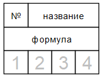
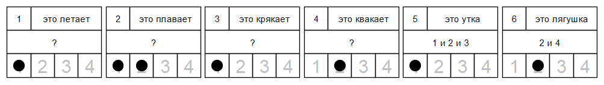

# Архитектура мозга. Концепция каналов  


## Предисловие

В данной статье я расскажу об одной своей гипотезе касательно архитектуры мозга.

Рассуждения строятся на очень простой концепции каналов. Возможно, читателю она даже покажется наивной. Тем не менее, мне пришлось приложить огромные усилия, чтобы додуматься до этого. Это не научная статья. Если кто-то назовет это очередной спекуляцией на теме мозга, то формально будет прав. Критика приветствуется.

<cut/>

## Введение

История этой гипотезы началась в 2015 году. В очередной раз размышляя над устройством мозга, я пришел к одной идее. Суть ее была в том, что мозг должен каким-то образом строить модель окружающей среды. Модель нужна, чтобы разорвать прямую связь между рецепторами и эффекторами. Существо без такой модели почти полностью зависит от внешних сигналов. Локомоция возможна либо как таксис, либо как случайное блуждание. В каком-то смысле такое существо подобно неживому объекту. Например, мяч двигается только когда получит "внешний сигнал" от ноги футболиста. Это мало чем отличается от условного одноклеточного, которое двигается по химическому градиенту в сторону питательных веществ. Его поведение точно так же полностью определено внешними сигналами. Изменить эту схему можно, поместив между рецепторами и эффекторами память, которая хранит грубую модель окружающей среды.

Эффекторы при этом будут получать сигналы уже от модели, а рецепторы будут использоваться для актуализации модели в реальном времени. Такая архитектура позволит существу реагировать на "невидимое". Например, когда химический градиент от пищи пропадает, существо помнит, в какую сторону нужно продолжать двигаться несмотря на временное отсутствие внешних сигналов. Закройте глаза и попробуйте вслепую взять любимую кружку с кофе со стола. Уверен, вы легко это проделаете, хотя не получаете никаких внешних сигналов от кружки. Ваши мышцы получают сигналы от актуальной модели кружки в мозге. Это и есть реакция на невидимое в моем понимании.

Как же устроена эта модель? В простейшем случае, видимо, модель может хранить два типа информации:

* Что - вид сигнала (пища, половой партнер, опасность и т.д.);
* Где - направление на источник сигнала (что-то вроде компаса).

Кажется, подобная схема управления должна дать ее обладателю определенные преимущества для выживания. Легко можно придумать развитие этой схемы. Например, добавить карту. Существо должно помнить, где находится на карте оно само и где находится источник сигнала. На следующем этапе развития мозг мог бы моделировать (предсказывать) перемещение сигнала по карте и тем самым давать условному хищнику возможность действовать на опережение. Все это довольно просто и очевидно до тех пор, пока речь идет о гипотетических примитивных существах. Совершенно непонятно, как строятся сложные модели. Есть ли какой-то общий принцип или подход для построения моделей любой сложности? Мне понадобилось около трех лет, чтобы найти удовлетворительную модель архитектуры мозга без квантовых эффектов и прочей "магии". Об этом и пойдет речь далее.

## Карточки

Представьте, что у вас есть набор одинаковых карточек, на которых есть поля для указания следующей информации:

* Уникальный номер;
* Название карточки;
* Формула зависимости от других карточек;
* Набор нумерованных клеток, которые можно пометить фишками.

Примерный внешний вид карточки:



Рассмотрим простой пример заполнения карточек:



Интерпретировать это можно следующим образом. Данный набор карточек является моделью объектов окружающей среды. Модель "знает" о существовании уток и лягушек. Текущая ситуация в модели фиксируется путем расстановки фишек в нумерованных клетках. Номер клетки называется каналом. Количество каналов определяет максимальное число объектов внешнего мира, которые отслеживаются в любой момент времени. На данной картинке в канале 1 отслеживается объект "утка", а в канале 2 - "лягушка". Причиной установки фишки на карточке может быть либо сигнал извне (например, с рецепторов), либо состояние других карточек. Зависимости карточек друг от друга определяются с помощью простых булевых формул. В каждом канале применяется одна и та же формула. Система работает по тактам. Состояние зависимых карточек в момент времени t образуется применением формул к состоянию системы в момент времени t-1.

Программист может обратить внимание, что применение формул похоже на побитовые операции с двоичными числами. Так и есть. Довольно легко можно запрограммировать действующую модель такой системы:

```python
class dotdict(dict):
    __getattr__ = dict.get
    def __setattr__(self, name, value):
        self[name] = value

class Machine:
    """
    Состояние машины хранится в словаре tick.
    На каждом такте вычисляется новое состояние в словаре tock.
    Затем tick и tock меняются местами и машина оказывается в новом состоянии.
    """

    def __init__(self, cells):
        self.cells = cells
        self.tick = dotdict()
        self.tock = dotdict()
        for key in cells:
            self.tick[key] = 0b0000
            self.tock[key] = 0b0000

    def step(self):
        """ один такт машины """
        for name, func in self.cells.items():
            if func is None:
                # функции нет, значит сигнал меняется только извне
                self.tock[name] = self.tick[name]
            else:
                # вычисление функции карточки от предыдущего состояния машины
                self.tock[name] = func(self.tick)
        # установка нового состояния
        self.tick, self.tock = self.tock, self.tick
        self.show()

    def show(self, comment = None):
        """ вывод состояния карточек """
        if comment is not None:
            print(f'Пояснение: {comment}')
        for key in cells:
            print(key, f'{self.tick[key]:04b}')
        print('------------------------------------------------')

# набор карточек
cells = {
    "C1": None,                         # это летает
    "C2": None,                         # это плавает
    "C3": None,                         # это крякает
    "C4": None,                         # это квакает
    "C5": lambda s: s.C1 & s.C2 & s.C3, # это утка
    "C6": lambda s: s.C2 & s.C4,        # это лягушка
}

# создание машины
m = Machine(cells)

# установка сигналов извне
m.tick.C1 = 0b0001
m.tick.C2 = 0b0011
m.tick.C3 = 0b0001
m.tick.C4 = 0b0010
m.show("Получены сигналы с рецепторов") # вывод состояния

# выполнение одного такта с выводом состояния
m.step()
```

Вывод:

```text
Пояснение: Получены сигналы с рецепторов
C1 0001
C2 0011
C3 0001
C4 0010
C5 0000
C6 0000
------------------------------------------------
C1 0001
C2 0011
C3 0001
C4 0010
C5 0001
C6 0010
------------------------------------------------
```

В данном примере демонстрируется "умозаключение" машины об объектах за один такт работы. С каждым тактом машина "узнает" об объектах все больше и больше. Часть информации поступает с рецепторов, часть последовательно выводится благодаря формулам.

Динамическое изменение объекта можно рассмотреть на следующем примере:


Соответствующий код:

```python
# набор карточек
cells = {
    "C1": None,                                 # это машет крыльями
    "C2": lambda s: s.C1 & s.C3 | ~s.C1 & s.C2, # крылья вверху
    "C3": lambda s: s.C1 & s.C2 | ~s.C1 & s.C3, # крылья внизу
}

m = Machine(cells)

m.tick.C1 = 0b0001 # рецепторы зарегистрировали, что объект в первом канале машет крыльями
m.tick.C2 = 0b0001 # рецепторы зарегистрировали, что у объекта в первом канале крылья внизу
m.show("Получены сигналы C1 и C2 с рецепторов")
m.step()
m.step()
m.step()
m.step()
m.tick.C1 = 0b0000 # рецепторы зарегистрировали, что объект в первом канале не машет крыльями
m.show("Пропал сигнал C1 с рецепторов")
m.step()
m.step()
```

Вывод:

```text
Пояснение: Получены сигналы C1 и C2 с рецепторов
C1 0001
C2 0001
C3 0000
------------------------------------------------
C1 0001
C2 0000
C3 0001
------------------------------------------------
C1 0001
C2 0001
C3 0000
------------------------------------------------
C1 0001
C2 0000
C3 0001
------------------------------------------------
C1 0001
C2 0001
C3 0000
------------------------------------------------
Пояснение: Пропал сигнал C1 с рецепторов
C1 0000
C2 0001
C3 0000
------------------------------------------------
C1 0000
C2 0001
C3 0000
------------------------------------------------
C1 0000
C2 0001
C3 0000
------------------------------------------------
```

На этом примере видно, как фишка "прыгает" в первом канале между карточками C2 и C3 до тех пор, пока активна карточка C1.

Еще один пример динамики:


Соответствующий код:

```python
# набор карточек
cells = {
    # это двигается влево
    "C1": None,
    # это двигается вправо
    "C2": None,
    # координата x == 1
    "C3": lambda s: s.C2 & s.C4 | s.C3 & ~s.C1 & ~s.C2,
    # координата x == 2
    "C4": lambda s: s.C1 & s.C3 | s.C2 & s.C5 | s.C4 & ~s.C1 & ~s.C2,
    # координата x == 3
    "C5": lambda s: s.C1 & s.C4 | s.C2 & s.C6 | s.C5 & ~s.C1 & ~s.C2,
    # координата x == 4
    "C6": lambda s: s.C1 & s.C5 | s.C6 & ~s.C1 & ~s.C2,
}

# создание машины
m = Machine(cells)

# установка сигналов извне
m.tick.C1 = 0b0001 # объект в первом канале начал двигаться вправо
m.tick.C3 = 0b0001 # объект в первом канале находится на координате x == 1
m.show("Получены сигналы C1 и C3 с рецепторов") # вывод состояния
m.step()
m.step()
m.step()
m.tick.C1 = 0b0000 # объект в первом канале больше не двигается вправо
m.tick.C2 = 0b0001 # объект в первом канале начал двигаться влево
m.show("Пропал сигнал C1 и получен сигнал C2 с рецепторов") # вывод состояния
m.step()
m.step()
m.step()
```

Вывод:

```text
Пояснение: Получены сигналы C1 и C3 с рецепторов
C1 0001
C2 0000
C3 0001
C4 0000
C5 0000
C6 0000
------------------------------------------------
C1 0001
C2 0000
C3 0000
C4 0001
C5 0000
C6 0000
------------------------------------------------
C1 0001
C2 0000
C3 0000
C4 0000
C5 0001
C6 0000
------------------------------------------------
C1 0001
C2 0000
C3 0000
C4 0000
C5 0000
C6 0001
------------------------------------------------
Пояснение: Пропал сигнал C1 и получен сигнал C2 с рецепторов
C1 0000
C2 0001
C3 0000
C4 0000
C5 0000
C6 0001
------------------------------------------------
C1 0000
C2 0001
C3 0000
C4 0000
C5 0001
C6 0000
------------------------------------------------
C1 0000
C2 0001
C3 0000
C4 0001
C5 0000
C6 0000
------------------------------------------------
C1 0000
C2 0001
C3 0001
C4 0000
C5 0000
C6 0000
------------------------------------------------
```

По этому примеру можно понять, как может происходить предсказание изменений, происходящих с объектом. Судьба объекта буквально проигрывается в модели в реальном времени. Этот процесс может происходить и с опережением реальных событий. Точность моделирования зависит только от количества карточек. Кроме того, на карточках вполне может быть организовано кодирование. Например, используя `n` карточек для фиксации координаты с точностью до метра, и `m` карточек для фиксации координаты внутри текущего метра с точностью до сантиметра. Вместо `n*m` карточек, используется всего `n+m`.

Специалист по искусственному интеллекту может заметить, что это похоже на обычного логического агента. Действительно, подобные агенты описаны, к примеру, в книге [[1]](#1 "Рассел С., Норвиг П. - Искусственный интеллект. Современный подход"). Более того, способ вычислений не привносит ничего нового по сравнению с моделью МакКаллока-Питтса. Если заменить карточки на нейроны, а формулы на пороговые функции, то получится исторически первая модель нейронной сети, которая при использовании задержек на нейронах по сути тоже работает аналогично по тактам. Отличия несущественны. На оригинальность претендует только концепция каналов.

Известно, что подобные логические сети с задержками эквивалентны конечным автоматам. Обычно конечные автоматы определяют перечислением всех его состояний. Логическая сеть отличается только тем, что ее состояние определяется совокупностью состояний всех элементов. Автомат, имеющий 256 состояний, описывается сетью из 8 элементов. Я не буду углубляться в детали. Интересующиеся могут почитать об этом в книге [[2]](#2 "Марвин Минский - Вычисления и автоматы").

Можно считать, что определенный набор карточек - это многоканальный конечный автомат.

Стоит добавить, что еще это похоже на разновидность FPGA. Из реальных архитектур, созданных человеком, это, возможно, самая близкая.

Что же означает одна карточка? Что угодно. Это может быть сигнал от конкретного рецептора, или абстрактная категория типа "человек", или какое-то событие, или свойство. В любом случае, это некоторая характеристика объекта. Она может быть как статической, так и динамической. Процесс переключения карточек может отражать изменение объекта во времени и пространстве. На карточках могут быть построены вычислительные процедуры для распознавания сигналов или для управления конечностями. Благодаря каналам система может моделировать несколько объектов или процессов одновременно. С помощью карточек могут быть смоделированы карты окружающего пространства, на которых одновременно отслеживается положение и перемещение нескольких объектов. Поиск кратчайшего пути между узлами такой карты может быть выполнен параллельным обходом в ширину, как описано, например, в книге [[3]](#3 "Каляев А.В., Чернухин Ю.В., Носков В.Н., Каляев И.А. - Однородные управляющие структуры адаптивных роботов").

Отдельная карточка не может содержать переменную величину. Например, плавное изменение цвета объекта будет отслеживаться как перемещение фишки по карточкам, каждая из которых представляет отдельный конкретный оттенок. То же самое с положением в пространстве. Благодаря этому в модели возможны противоречия, когда объект с точки зрения модели одновременно большой и маленький, или холодный и горячий, или зеленый и красный, или находится и тут и там. Любой объект может иметь любые свойства и любые их сочетания. Это право модели на ошибку, если угодно.

На понятии объекта стоит остановиться отдельно. Это ключевой и самый странный элемент гипотезы. Я предполагаю, что в мозге нет никакой модели среды. Есть только одна модель универсального объекта, который может быть чем угодно. Одна и та же модель используется для моделирования любого элемента окружающей среды. Лягушка, утка, карандаш, человек, небо, математика, четверг - все эти объекты отслеживаются в рамках одной модели. Все знания мозга об объектах (элементах, срезах) окружающей среды сосредоточены в карточках и связях между ними. Каналы позволяют на одной и той же модели отслеживать несколько объектов. В одном канале моделируется один объект. Грубо говоря, окружающая реальность для существа в каждый момент времени полностью определена состоянием карточек во всех каналах. Богатое и сложное восприятие - это иллюзия, которую формирует быстрое переключение каналов и процессы, происходящие в этих каналах. Кроме того, речь пока не идет об осознанном восприятии.

Думаю, читатель уже догадался, что под набором карточек я предполагаю кору головного мозга. Отдельная карточка - это миниколонка коры. Но хочу обратить внимание, что это лишь очень грубая модель. Я пытался в ней ухватить только общий принцип организации. В частности, бинарное состояние и соответствующие формулы - это намеренное упрощение. Более реалистичной мне видится нечеткая логика, но в данной статье этим можно пренебречь.

## Каналы

Из описания карточек можно понять, как представлены объекты внешней среды в коре головного мозга. Но это не дает понимания, как это в целом работает в процессе жизни. Например, существо услышало хруст ветки справа от себя. Что будет происходить в коре?

Для начала нужно ввести понятие внимания. В каждый момент времени существо собирает информацию только об одном объекте. Механизм внимания определяет, какой канал актуализируется в данный момент. Остальные каналы при этом продолжают работать и предсказывать изменения отслеживаемых объектов, но информация в них быстро устаревает. Взаимодействие с несколькими объектами предполагает постоянное быстрое переключение внимания с одного канала на другой. Алгоритм внимания, по всей видимости, может иметь (и скорее всего имеет) разные реализации. Не будем углубляться в детали. Отмечу лишь, что механизм внимания - это внешнее по отношению к коре устройство.

Реакция существа на резкий звук справа может быть такой:

1. Механизм внимания проверяет, ожидался ли поступивший сигнал в текущем канале.
2. Если ожидался, то сигнал просто пропускается в соответствующие карточки.
3. Если не ожидался, то проверяются другие каналы. В случае успеха внимание переключается на другой канал и выполняется пункт 2.
4. Если подходящий канал не найден, то механизм выбирает один из каналов, очищает его, делает текущим и начинает отслеживать новый объект.

Ожидание сигнала может означать две вещи. Во-первых, в канале уже есть некоторая информация об объекте. Как уже говорилось выше, в простейшем случае это ответы на вопросы "Что?" и "Где?". Если в данный момент отслеживается объект, который уже отнесен к карточке "справа", то можно считать, что он "ожидает" пришедший справа сигнал. Во-вторых, можно допустить, что на каждый объект выделяется не один, а два канала. В одном из них содержится только реально зарегистрированная информация, а в другом ожидаемая. Это очень просто. Допустим, есть две карточки "это лягушка" и "это квакает". Карточки зависят друг от друга. Если система по каким-то признакам, кроме кваканья, зарегистрировала лягушку, то в результате установки фишки на карточке "это лягушка" будет спровоцирована установка фишки в карточке "это квакает", но только в канале ожидания для этого объекта. Когда лягушка реально квакнет, канал ожидания даст механизму внимания всю необходимую информацию. Парные каналы приведены только для примера. Возможно, реальный механизм работает в рамках одного канала.

Из этого описания можно заключить, что кора выполняет двойную роль. С одной стороны, это сверхоперативная память, которая позволяет отслеживать объекты здесь и сейчас. Состояние канала может быть целиком изменено за один такт. В цифровом компьютере аналогом являются регистры и, возможно, кэш. Каналов тоже мало. Они очень быстрые. Все "вычисления" выполняются на них, и они очень дорогие. Добавить один канал можно только ценой добавления огромного числа нейронов. С другой стороны, это постоянная память. Выражается это в наличии ожидаемых сигналов. Извлечение чего-либо из постоянной памяти никак не выделено в общей механике. Это все те же зависимости карточек друг от друга. Просто информация в каналах условно делится на зарегистрированную и на ожидаемую.

Далее нужно разобраться, что происходит с каналом, который очищается для отслеживания нового объекта. Тут возможно два варианта. Либо информация об объекте бесследно теряется. Либо сбрасывается куда-то во временную память. Существование временной памяти можно предположить просто потому, что мы способны помнить события, произошедшие, скажем, час назад, несмотря на постоянное переключение внимания. Другой аргумент в пользу временной памяти - это способность запоминать что-то в постоянной памяти. Процесс формирования новых связей мгновенным быть не может, а удержание каналов в этом процессе быстро лишит существо возможности что-либо воспринимать. Следовательно, информацию из канала нужно куда-то скинуть и хранить, пока нужные связи не сформируются. Мне кажется, что так оно и должно быть, но есть одна трудность. Дело в том, что емкость канала огромна. В мозге просто нет места для "слепков" каналов. Кроме того, возникает вопрос адресации. Во временной памяти нужно как-то ссылаться на запоминаемые карточки. Это требует уже довольно сложных способов кодирования адресов. У меня пока нет идей, как это может быть устроено. Но касательно объема слепка есть некоторые соображения.

Взаимодействие разных видов памяти схематично можно представить так:


Важно отметить, что во временной памяти нет никаких процессов. Моделирование объекта возможно только в канале. Извлечение объекта из временной памяти - это восстановление в канале его состояния на момент сохранения. Взаимодействие с многими объектами предполагает постоянный обмен информацией между каналами и временной памятью.

Невозможность сохранить всю информацию канала во временной памяти наталкивает на мысль, что сохраняется только малая ее часть. Непонятно только, по какому принципу выбирается эта часть. Можно предположить, что в каждый момент времени работает только часть коры, и существует балансировщик, который следит, чтобы расход ресурсов не выходил за определенные границы. Допустим, одновременно работать может только тысяча карточек. Балансировщик по своему усмотрению одним карточкам разрешает работать, а другим запрещает. Так регулируется расход энергии и создается препятствие для распространения "навязчивых мыслей". Следствием отключения балансировщика, вероятно, будет эйфория. Ограничение, которое накладывает балансировщик, должно быть связано с максимальным объемом слепка во временной памяти. Что именно будет сохранено определяется просто текущей активностью.

До сих пор речь шла о коре как о целом. Из описания можно подумать, что абсолютно все колонки коры участвуют в моделировании объектов на нескольких каналах. Это не так. Можно считать, что это описание только одной ассоциативной области коры. В других областях происходит примерно то же самое, но не в целях моделирования объектов. Слуховая кора с помощью каналов делит вашу любимую музыкальную композицию на отдельные инструменты. Вы можете переключить внимание то на ударные, то на гитару. Внимательно слушать своего собеседника у вас тоже получается благодаря каналам. Отдельная область коры - это отдельный мир со своими каналами и специфичными карточками. В зрительной коре в отдельных каналах картинка может делиться по цвету, например. Все элементы одного цвета собираются в одном канале и это позволяет вам мгновенно отделить буквы этой статьи от фона. Это похоже на слои в графических редакторах. В обонятельной коре каналы позволяют вам четко различать несколько разных запахов. Другими словами, основная роль каналов в этих областях - это группировка поступающей информации по какому-то признаку. Это позволяет сосредоточить внимание на отдельном "срезе" воспринимаемого и не терять при этом из виду остальное. Вы не перестанете слышать музыку, если услышите, как мяукает кот. Механизм внимания просто выберет один канал и будет какое-то время отслеживать мяуканье в нем. Это несколько ограничит полноту восприятия музыки, но позволит вам выжить (коты могут быть опасны). Это событие, кстати, спровоцирует выделение канала и в ассоциативной области. Между областями при этом установится связь, что звук в канале `n` в слуховой коре принадлежит объекту в канале `m` в ассоциативной коре. Подобная ассоциация возникнет, например, и со зрительной корой, в которой изображение кота будет собрано в одном канале. Если кот наконец перестанет мяукать, то канал в слуховой коре освободится и связь с ассоциативной корой разорвется. Но вы при этом можете продолжать думать о коте и опасности, которая от него исходит.

Благодаря каналам возможно отслеживание отношений между объектами и их сравнение. Работает это с помощью порталов между каналами. Но это тема для отдельной статьи. Так же отдельного описания требуют механизмы зрения, ориентирования в пространстве и построения движений. Наиболее волнительным, видимо, является вопрос сознания. Если коротко, то универсальная модель объекта в коре включает и ваше "Я". То, что вы считаете собой - это просто объект в одном из каналов. Объект с root-доступом к системе. Отдельная область коры является песочницей, в которой вы формируете свой маленький искусственный мир, думаете, воображаете, планируете, творите.

## Заключение

В данной статье рассмотрены гипотетические каналы коры головного мозга. Описано предполагаемое их назначение и принцип работы. Кроме того, в статье выдвинуты предположения о механизмах, взаимодействующих с корой. Это механизм внимания, временная память и балансировщик.

Существование каналов является ключевым элементом гипотезы. Процессы, происходящие в каналах, являются основой механизма обработки информации в мозге. Число каналов мало и фиксировано. В каждый момент времени окружающая обстановка представлена в мозге с помощью нескольких объектов, которые отслеживаются в отдельных каналах. Что это за объекты, какие у них свойства и что с ними происходит, полностью определяется состоянием канала. Роль каналов в разных областях коры неодинакова. Например, в сенсорных областях в отдельном канале находится некоторый срез/группировка входящих сигналов по определенному признаку. Другими словами, это некоторый образ, который выхватывается из потока входящей информации и удерживается как единое целое. Кроме того, в некоторых областях коры каналы могут использоваться для каких-то совсем специфичных целей. Тем не менее, предполагается, что принцип работы в основном един для всей коры.

Каналы нужны для:

1. Регистрации и представления объектов в реальном времени.
2. Учета и предсказания изменений объектов.
3. Учета более одного объекта в коротких промежутках времени.
4. Учета отношений между объектами и их сравнения.
5. Переключения внимания с одного объекта на другой.
6. Формирования слепка информации для сохранения в постоянной памяти (посредством временной).
7. Исполнения процедур распознавания образов и построения движений.
8. Параллельного учета и обработки отдельных срезов входящей информации.
9. Построения карт окружающего пространства.
10. Хранения сознания.

Сама по себе идея многоканальных автоматов не нова. Фон Нейман, например, предлагал использовать метод кратных линий для повышения надежности. Рекомендую к прочтению его книгу [[4]](#4 "Джон фон Нейман - Вычислительная машина и мозг"). Взгляд фон Неймана на проблему близок по духу данной статье. Он тоже рассматривал мозг как специализированную вычислительную машину.

Организация "мышления" на карточках тоже не мое изобретение. Подобная логика была уже у знаменитой мыши Клода Шеннона, которая могла найти выход из лабиринта. Похожий принцип давно используется и в логических агентах [[1]](#1 "Рассел С., Норвиг П. - Искусственный интеллект. Современный подход"). Идея вычислений на массиве однородных элементов также используется в робототехнике [[3]](#1 "Каляев А.В., Чернухин Ю.В., Носков В.Н., Каляев И.А. - Однородные управляющие структуры адаптивных роботов").

## Литература

<a id="1">1.</a> Рассел С., Норвиг П. - Искусственный интеллект. Современный подход.  
<a id="2">2.</a> Марвин Минский - Вычисления и автоматы.  
<a id="3">3.</a> Каляев А.В., Чернухин Ю.В., Носков В.Н., Каляев И.А. - Однородные управляющие структуры адаптивных роботов.  
<a id="4">4.</a> Джон фон Нейман - Вычислительная машина и мозг.  
