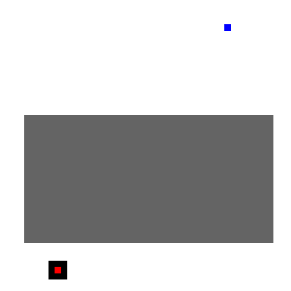
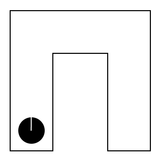

# Архитектура мозга. Концепция матриц


В прошлой статье было показано какие процессы могут происходить в мозге на низком уровне. В этот раз речь пойдет уже о конкретных задачах, решаемых нервной системой.

Данная статья не претендует на научность. Читатель может считать ее чистой спекуляцией. Критика приветствуется.

<cut/>

## Введение

Концепция матриц проста и интуитивно понятна. Нервная система в целом и кора головного мозга в частности, рассматриваются как сеть из нервных узов. А если говорить более формально, то это сеть из конечных автоматов или *акторов*. Матрица - это многозначный термин, который в зависимости от контекста может означать либо тип (структуру) узла, либо генетический код, который строит узел и связывает его с сетью. Сети из однородных узлов тоже называются матрицами. Конкретные экземпляры таких сетей и их комплексов в дальнейшем будут называться *картами*.

Для решения каждой специфической задачи используется отдельная матрица. Колоночная организация коры с каналами из прошлой статьи - это матрица первого порядка. Колонки могут быть объединены в однородные кластеры и собраны в сеть кластеров матрицей второго порядка.

## Репрезентация пространства

```
"Каждый мускул дает происхождение особому ощущению, способному делаться больше или меньше, так что совокупность наших мускульных ощущений будет зависеть от стольких переменных, сколько у нас мускулов. С этой точки зрения моторное пространство имело бы столько измерений, сколько мы имеем мускулов."
Анри Пуанкаре "О науке"
```

В статье о концепции каналов говорилось, что на карточках (миниколонках коры) могут быть построены карты окружающего пространства. Рассмотрим самый примитивный вариант карты, который я называю *компасом*. В виде таблицы компас можно записать так (каждая строка это колонка коры):

|Номер|Название|Каналы|Формула                                    |Пояснение                           |
|-----|--------|------|-------------------------------------------|------------------------------------|
|    1|Налево  |0000  | ?                                         |Сигнал о выполнении моторной команды|
|    2|Направо |0000  | ?                                         |Сигнал о выполнении моторной команды|
|    3|Впереди |0000  | (не 1 и не 2 и 3) или (1 и 5) или (2 и 4) |Позиция цели                        |
|    4|Справа  |0000  | (не 1 и не 2 и 4) или (1 и 3) или (2 и 6) |Позиция цели                        |
|    5|Слева   |0000  | (не 1 и не 2 и 5) или (1 и 6) или (2 и 3) |Позиция цели                        |
|    6|Сзади   |0000  | (не 1 и не 2 и 6) или (1 и 4) или (2 и 5) |Позиция цели                        |

С помощью такой карты существо может отслеживать положение вплоть до четырех неподвижных целей относительно себя. Узлы с 3 по 6 - это специфическая матрица первого порядка (вариант колоночной организации). Связи в такой матрице строятся генетическим кодом. Узлы 1 и 2 - это другая матрица первого порядка (сенсорная), и она может быть даже одноканальной. Как видно из формул, между матрицами разного типа могут существовать связи.

Теперь рассмотрим пример более сложной карты, которая строится матрицей второго порядка. Эта карта состоит из кластеров колонок и решает задачу построения программ локомоции в пространстве. Например, перемещение к зарегистрированной цели, или возвращение в гнездо после охоты. Запись в виде таблицы будет слишком сложна для восприятия, поэтому я реализовал действующий пример с визуализацией процесса:

<spoiler title="Анимация:">

</spoiler>

Синяя точка - это позиция самого существа. Красная - это цель. Построение программы локомоции - это поиск кратчайшего пути в графе из кластеров карты. Так как система параллельная, в ней естественным путем выполняется поиск в ширину. Из кластера цели одновременно отправляются сигналы всем связанным кластерам. Процесс лавинообразный. Каждый кластер запоминает, по какой линии связи сигнал пришел первым. Когда сигнал достигает позиции существа, карта переключается в режим локомоции. Сигнал последовательно движется к цели и тем самым может запускать моторные программы, связанные с кластерами. Виртуальное перемещение в модели реализуется как локомоция в окружающей среде. Исполнение контролируется обратной связью от сенсоров. Каждый кластер может помнить, как ощущается пространство из точки, которую он представляет, и прерывать процесс, если что-то идет не так.

<spoiler title="Исходный код:">

```python
class Machine:

    def __init__(self, cells):
        self.cells = cells
        self.state = {}
        self._state = {}
        for key in cells.keys():
            self.state[key] = 0b0000
        
    def step(self):
        for key, f in self.cells.items():
            if f is None:
                self._state[key] = self.state[key]
            else:
                self._state[key] = f(self.state)
        self.state, self._state = self._state, self.state

cells = {}

# матрица:
# n1    n2    n3
#    g1 g2 g3
# n8 g8 n0 g4 n4
#    g7 g6 g5
# n7    n6    n5

# размеры карты
h, w = 50, 50

# сигнал, указывающий что возбудился хотя бы один узел с меткой
# цикл эмулирует множество однотипных связей
def stop(s):
    res = 0b0000
    for x in range(1, w-1):
        for y in range(1, h-1):
            res = res | s[x, y, 'node', 'mark'] & s[x, y, 'node']
    return res & s['mode1']
cells['stop'] = stop

# режим поиска пути
cells['mode1'] = lambda s: s['mode1'] & ~s['stop']
# режим движения по построенному пути
cells['mode2'] = lambda s: s['mode2'] | s['stop']

# предварительное создание узлов, меток и ворот
for x in range(0, w):
    for y in range(0, h):
        cells[x, y, 'node'] = None    
        cells[x, y, 'node', 'mark'] = None    
        for i in range(1, 9):
            cells[x, y, 'gate', i] = None    
            cells[x, y, 'gate', i, 'mark'] = None   

def apply_matrix(x, y):
    # режимы
    m1 = 'mode1' # прямой ход
    m2 = 'mode2' # обратный ход
    m3 = 'stop'  # сигнал остановки поиска
    # ворота
    g1 = x, y, 'gate', 1 
    g2 = x, y, 'gate', 2
    g3 = x, y, 'gate', 3
    g4 = x, y, 'gate', 4
    g5 = x, y, 'gate', 5
    g6 = x, y, 'gate', 6
    g7 = x, y, 'gate', 7
    g8 = x, y, 'gate', 8
    # метки на воротах
    gm1 = x, y, 'gate', 1, 'mark' 
    gm2 = x, y, 'gate', 2, 'mark'
    gm3 = x, y, 'gate', 3, 'mark'
    gm4 = x, y, 'gate', 4, 'mark'
    gm5 = x, y, 'gate', 5, 'mark'
    gm6 = x, y, 'gate', 6, 'mark'
    gm7 = x, y, 'gate', 7, 'mark'
    gm8 = x, y, 'gate', 8, 'mark'
    # метки на воротах соседей
    _gm1 = x-1, y-1, 'gate', 5, 'mark'
    _gm2 = x+0, y-1, 'gate', 6, 'mark' 
    _gm3 = x+1, y-1, 'gate', 7, 'mark' 
    _gm4 = x+1, y+0, 'gate', 8, 'mark' 
    _gm5 = x+1, y+1, 'gate', 1, 'mark' 
    _gm6 = x+0, y+1, 'gate', 2, 'mark' 
    _gm7 = x-1, y+1, 'gate', 3, 'mark' 
    _gm8 = x-1, y+0, 'gate', 4, 'mark'
    # узел
    n0 = x, y, 'node'
    # пометка на узле
    nm0 = x, y, 'node', 'mark'
    # соседи
    n1 = x-1, y-1, 'node'
    n2 = x+0, y-1, 'node' 
    n3 = x+1, y-1, 'node' 
    n4 = x+1, y+0, 'node' 
    n5 = x+1, y+1, 'node' 
    n6 = x+0, y+1, 'node' 
    n7 = x-1, y+1, 'node' 
    n8 = x-1, y+0, 'node' 
    # узел будет активизирован если активны хотя бы одни ворота
    cells[n0] = lambda s: s[m3] & s[nm0] | ~s[m3] & (s[g1] | s[g2] | s[g3] | s[g4] | s[g5] | s[g6] | s[g7] | s[g8])
    # пометка ставится извне
    cells[nm0] = None
    
    # режим1: ворота активизируются если активен соответствующий этим воротам соседний узел
    # режим2: ворота активизируются если активен соответствующий этим воротам соседний узел и активна метка на соответствующих воротах соседа
    cells[g1] = lambda s: (s[m1] & s[n1]) | (s[m2] & s[n1] & s[_gm1])
    cells[g2] = lambda s: (s[m1] & s[n2]) | (s[m2] & s[n2] & s[_gm2])
    cells[g3] = lambda s: (s[m1] & s[n3]) | (s[m2] & s[n3] & s[_gm3])
    cells[g4] = lambda s: (s[m1] & s[n4]) | (s[m2] & s[n4] & s[_gm4])
    cells[g5] = lambda s: (s[m1] & s[n5]) | (s[m2] & s[n5] & s[_gm5])
    cells[g6] = lambda s: (s[m1] & s[n6]) | (s[m2] & s[n6] & s[_gm6])
    cells[g7] = lambda s: (s[m1] & s[n7]) | (s[m2] & s[n7] & s[_gm7])
    cells[g8] = lambda s: (s[m1] & s[n8]) | (s[m2] & s[n8] & s[_gm8])
    
    gm_ = lambda s: s[gm1] | s[gm2] | s[gm3] | s[gm4] | s[gm5] | s[gm6] | s[gm7] | s[gm8]
    
    # режим1: метка активизируется если активны соответствующие ворота и нет сигнала стоп;
    # выполняется упорядоченный выбор только одной метки (хвосты формул) если активны сразу несколько ворот;
    # метка остается активной после первой активации
    # режим2: метка остается активной, если была активна на момент включения режима
    cells[gm1] = lambda s: (s[m2] & s[gm1]) | (s[m1] & (s[gm1] | s[g1] & ~gm_(s) & ~s[m3] & ~s[g2] & ~s[g4] & ~s[g6] & ~s[g8] & ~s[g3] & ~s[g5] & ~s[g7]))
    cells[gm2] = lambda s: (s[m2] & s[gm2]) | (s[m1] & (s[gm2] | s[g2] & ~gm_(s) & ~s[m3] & ~s[g4] & ~s[g6] & ~s[g8]))
    cells[gm3] = lambda s: (s[m2] & s[gm3]) | (s[m1] & (s[gm3] | s[g3] & ~gm_(s) & ~s[m3] & ~s[g2] & ~s[g4] & ~s[g6] & ~s[g8] & ~s[g5] & ~s[g7]))
    cells[gm4] = lambda s: (s[m2] & s[gm4]) | (s[m1] & (s[gm4] | s[g4] & ~gm_(s) & ~s[m3] & ~s[g6] & ~s[g8]))
    cells[gm5] = lambda s: (s[m2] & s[gm5]) | (s[m1] & (s[gm5] | s[g5] & ~gm_(s) & ~s[m3] & ~s[g2] & ~s[g4] & ~s[g6] & ~s[g8] & ~s[g7]))
    cells[gm6] = lambda s: (s[m2] & s[gm6]) | (s[m1] & (s[gm6] | s[g6] & ~gm_(s) & ~s[m3] & ~s[g8]))
    cells[gm7] = lambda s: (s[m2] & s[gm7]) | (s[m1] & (s[gm7] | s[g7] & ~gm_(s) & ~s[m3] & ~s[g2] & ~s[g4] & ~s[g6] & ~s[g8]))
    cells[gm8] = lambda s: (s[m2] & s[gm8]) | (s[m1] & (s[gm8] | s[g8] & ~gm_(s) & ~s[m3]))
        
# построение карты
for x in range(1, w-1):
    for y in range(1, h-1):
        apply_matrix(x, y)

# ограничение на количество итераций для формирования gif
count = 81

# # дырка в сети
# hole_x, hole_y = (5, 45), (20, 40)
# for x in range(hole_x[0], hole_x[1]+1):
#     for y in range(hole_y[0], hole_y[1]+1):
#         cells[x, y, 'node'] = None
# count = 120
            
# создание машины
m = Machine(cells)          

# позиция существа на карте
self_x, self_y = 38, 5
# позиция цели на карте
target_x, target_y = 10, 45

# сигналы извне карты (режим поиска, метка позиции существа, позиция цели)
m.state['mode1'] = 0b0001
m.state['mode2'] = 0b0000
m.state[self_x, self_y, 'node', 'mark'] = 0b0001
m.state[target_x, target_y, 'node'] = 0b0001

from PIL import Image, ImageDraw

images = []

def draw_cell(draw, x, y, c):
    draw.rectangle([x*10, y*10, x*10+10, y*10+10], c)

def draw():
    im = Image.new("P", ((w-2)*10, (h-2)*10), 1)
    im.putpalette([
        0, 0, 0,
        255, 255, 255,
        255, 0, 0,
        0, 0, 255,
        100, 100, 100,
    ])
    images.append(im)
    draw = ImageDraw.Draw(im)
    # отрисовка активации одного канала карточек типа "узел"
    for x in range(1, w-1):
        for y in range(1, h-1):
            if m.state[x, y, 'node'] == 0b0001:
                draw_cell(draw, x-1, y-1, 0)
    # отрисовка позиции цели
    draw_cell(draw, target_x-1, target_y-1, 2)
    # отрисовка позиции существа
    draw_cell(draw, self_x-1, self_y-1, 3)
    # # отрисовка дырки (мертвых нейронов)
    # draw.rectangle([(hole_x[0]-1)*10, (hole_y[0]-1)*10, (hole_x[1]-1)*10+10, (hole_y[1]-1)*10+10], 4)

# итерации машины и выборочная отрисовка состояния одного канала в gif
for i in range(count):
    m.step()
    m.step()
    draw()
    
images[0].save("map.gif", save_all=True, append_images=images[1:], duration=100, loop=0)
```

</spoiler>

Подобная механика кажется довольно правдоподобной. Поиск пути может выполняться очень быстро, потому что любые два кластера карты могут быть связаны напрямую в том случае, если есть подходящая моторная программа для перехода между ними или если существует путь через другие кластеры. Расстояние между кластерами фиксируется либо с помощью искусственной задержки при передаче сигнала, либо с помощью приоритетов (как в примере). Важно отметить, что нейроны в процессе поиска активизируются только один раз. Это значит, что скорость поиска пути не ограничена маленькой частотой работы нейронов. Фактически это похоже на разряд молнии, который ограничен только скоростью передачи сигнала между нейронами.

Физическое расположение кластеров в коре никак не связано с геометрией пространства. Отношения между кластерами косвенно определяются связанными моторными командами. Связи между кластерами формируются под влиянием моторного опыта, а затем используются для воспроизведения этого опыта. Карта не двухмерная и даже не трехмерная. Она вообще ничего не "знает" о координатах и измерениях. Например, команда поворота туловища налево - это перемещение в другой кластер, хотя в физическом пространстве вы находитесь в той же точке. В модели приведен двухмерный вариант с моторными командами по восьми направлениям только из-за простоты восприятия. На самом деле карта допускает перемещение между кластерами даже с помощью взмаха волшебной палочкой. Это позволяет мозгу без проблем воспринимать невозможные пространства, в которых, например, есть порталы.

Благодаря матричной организации подобные карты устойчивы к повреждениям. Если физически путь между кластерами существует, то он будет найден. Можно "убить" большой кусок карты, и она все равно будет решать свои задачи в обход мертвых кластеров:

<spoiler title="Анимация:">

</spoiler>

Более того, кластеры могут притворяться мертвыми, и тем самым уточнять текущую структуру пространства. Например, идти через кластер, в котором находится хищник, в целом плохая идея. Лучше выключить этот кластер и его соседей перед поиском пути. Функция отключения при этом изначально заложена в матрице кластера.

Достаточно сложная карта может полностью описывать воспринимаемый трехмерный мир. Хорошей аналогией являются электронные карты, в которых вы можете совершать виртуальные прогулки, перемещаяясь от узла к узлу по графу фотографий. В принципе, мозг может строить граф пространства тем же способом. В каждом узле графа точно так же делается снимок сенсорных ощущений. Отличие только в том, что мозг очень активно переиспользует подграфы этого графа. Почти все, что вы ощущаете, -  это множество активных подграфов из прошлого опыта. Например, образ типичного угла между стенками в квартире - это граф в единственном экземпляре, который активизируется и детализирует пространство в точке взора каждый раз, когда вы смотрите на похожий угол. Сам этот подграф тоже переиспользует меньшие подграфы. В дублировании структур нет необходимости, так как в один момент времени вы смотрите только в одну точку пространства. Марвин Мински в модели фреймов высказывал похожие идеи. 

Модели трехмерных объектов в окружающем пространстве - это те же подграфы. Проще всего это представить как набор фотографий объекта, сделаных с разных точек зрения. Каждая точка - это кластер в карте. Между кластерами точно так же работают переходы посредством моторных команд. Мысленное вращение в уме трехмерного объекта - это по сути полет вокруг него. Только вместо взмахов крыльями вы скорее всего виртуально посылаете высокоуровневые команды своим рукам. 

Граф вашей квартиры может иметь всего по одному кластеру на комнату. Другими словами, это только общий план, чтобы отличать одну комнату от другой в пространстве. Все детали - это ссылки на подграфы. Поиск пути в таких многоуровневых графах происходит по уровням. Сначала получается грубый путь на самом верхнем уровне, затем каждая часть пути уточняется на подчиненном уровне и так далее. Причем уточнение гипотетически может происходить уже в процессе исполнения команд вышестоящих уровней.

<spoiler title="Граф квартиры:">

</spoiler>

На данной картинке очень грубо показана структура графа квартиры из трех одинаковых комнат. Узлы 1, 2 и 3 - это положение комнат на самом верхнем уровне. Узел 4 и соседние с ним - это общая геометрия комнаты на втором уровне. Узел 5 и соседние с ним - это геометрия угла, воспринимаемая из разных точек локального пространства на третьем уровне. Серым цветом отмечено текущее положение в пространстве на трех уровнях (это реальные метки в одном канале в кластерах карты). 

Реальное физическое положение в пространстве и направление взора могут быть, например, такими:

<spoiler title="Физическое положение:">

</spoiler>

Из данного описания должно быть понятно, что карты могут создать очень насыщенные субъективные переживания. Кластеры, связанные с текущими, дают вам предсказание, как будет выглядеть мир после выполнения определенных моторных команд. Вы будто способны видеть мир сразу из нескольких точек, дополняя сенсорные ощущения прошлым опытом.

## Построение движений

Для начала рассмотрим, как могут быть организованы генераторы автоматических движений. Допустим, нам надо построить нервную систему примитивного насекомого. Как это сделать проще всего? У насекомых шесть лапок. Движение каждой лапки в процессе ходьбы выглядит как зацикленная анимация. Это значит, что управляющим устройством для каждой лапки может быть самостоятельный конечный автомат. Каждое состояние автомата - это конкретное напряжение мышц и соответствующее положение лапки. Автомат просто переходит из одного состояния в другое по кругу. Итак, мы можем поместить в тело нашего насекомого шесть конечных автоматов. Причем автоматов одинаковых по структуре. Эти автоматы надо периодически включать и выключать, значит нам нужен еще один управляющий автомат, который логично поместить в голове насекомого, поближе к самым важным сенсорам. Его устройство нас сейчас не интересует. От этого автомата к остальным нужно протянуть шину из двух проводов, которая нужна для передачи сигналов "старт" и "стоп". Нервная система приобретает примерно такой вид:

<spoiler title="Нервная система (вариант 1):">

</spoiler>

Такая организация управления уже позволяет насекомому перемещаться в пространстве, но не очень эффективно. Работа автоматов не согласована между собой, а значит стоять на лапках такое насекомое долго не сможет. Будет гребсти лапками как веслами вразнобой. Для согласования работы автоматов и реализации тем самым некоторого аллюра нужно, чтобы автоматы передавали друг другу синхронизирующие сигналы. Для этого их нужно соединить между собой шинами. Если все шины аккуратно разместить в кабель-каналах, то нервная система будет выглядеть примерно так:

<spoiler title="Нервная система (вариант 2):">

</spoiler>

Уже лучше, но скорость анимации было бы неплохо регулировать. Если искать пищу еще можно неторопливо, то спасаться от опасности уже лучше бегством. Для этого нужно немного модифицировать автоматы, чтобы они меняли состояние только по специальному сигналу. Источником такого тактового сигнала пусть будет еще один автомат, размещенный в голове. Назовем его генератором ритма. Чем быстрее ритм, тем быстрее "проворачивается" анимация. При отсутствии ритма движения нет, а значит больше не нужны сигналы "старт" и "стоп". Можно использовать свободную шину для передачи других сигналов. Например, "вперед" и "назад". Но автоматы в этом случае должны уметь выполнять две разные анимации. В этом нет никакой трудности, просто переходы между состояниями начинают зависеть еще и от режима. Репертуар автомата может быть настолько большим, насколько позволяют ресурсы.

Таким образом, у нас получается что-то вроде кибернетической галеры. Есть шесть гребцов, знающих несколько режимов или стилей гребли и раздающих друг другу подзатыльники при нарушениях командной работы. Есть барабанщик, задающий темп. Есть капитан, у которого скорее всего есть подзорная труба и карта. Он смотрит в трубу, отмечает на карте вражеские корабли и периодически выкрикивает команды "Назад!", "Быстрее!" и тому подобное. Капитан так увлечен своими делами, что понятия не имеет о происходящем на галере. Он даже не знает состав экипажа.

Из данного описания должно быть понятно, что в организации стереотипных движений нет никакой загадки. Движения реализует самостоятельный автомат, который просто воспроизводит запись анимации. Эта анимация может иметь несколько режимов, она может быть параметризована, но это все равно анимация. Представить себе такой автомат из нейронов не трудно. Плавность движений может достигаться двумя путями. Во-первых, мышцы не могут реагировать на сигналы мгновенно и немного сглаживают дискретные переходы между состояниями. Во-вторых, природа может использовать что-то вроде нечеткой логики, когда сигнал может иметь значение в диапазоне 0..1. Состояние автомата в этом случае может быть размазано на несколько соседних нейронов в цепи анимации.

<spoiler title="Нечеткое состояние:">

</spoiler>

Состояние нейрона и соответствующее напряжение мышц в этом случае плавно меняются с каждым тактом. Гипотетически система может быть устроена таким образом, что будет работать и в бинарной логике и с любой степенью размазывания.

В настоящем организме, конечно, происходят более сложные и тонкие процессы, но не думаю, что они сильно отличаются от данного описания.

Все эти рассуждения приведены в частности для того, чтобы читатель мог провести параллели с картой, которая строит программу локомоции. Построение пути в пространстве - это фактически создание временного стереотипного автомата. Другими словами, карты способны строить и выполнять произвольные движения. Например, для перемещения кулака в конкретную точку локального пространства (лицо автора, к примеру), нужно найти конечное положение локтя. Поиск точки может быть выполнен так:

<spoiler title="Положение локтя:">

</spoiler>

Синяя точка - это текущее положение плеча. Красная - это целевое положение кулака. Сигнал начинает распространяться из синей точки.
Каждый кластер в такой карте "знает" длину каждого звена конечности. Это знание выражается в том, что сигнал нужно передавать только определенным кластерам. Круги на карте должны помочь представить расположение этих кластеров. Поиск нужного положения выполняется тут в два шага. Сначала активизируется "круг" кластеров вокруг синей точки, потом эти кластеры активизируют уже свое "окружение". Кому повезло первым активизировать красную точку, тот и локоть. Если конечность имеет 10 звеньев, то будет 10 шагов. Результат работы карты - это конечное положение всех сочленений. Остается запустить стереотипные программы для каждого звена, чтобы перевести конечность в новое состояние. Вероятно, такая система будет не очень точной, но ей еще помогает мозжечок, в котором нейронов гораздо больше, чем в коре. Кроме того, граф по аналогии с пространством может быть многоуровневым.

Надеюсь, из этого описания понятно, что поиск пути, и поиск положения конечности - это почти одна и та же задача. Матрица для построения произвольных движений - это скорее всего модифицированная матрица построения локомоторных программ, действующий пример которой приводился выше. А еще все это выглядит как дополнительные механики в репрезентации пространства.

## Локализация в пространстве

В описании репрезентации пространства подразумевалось, что существо знает, в какой точке оно находится. Но это, очевидно, не всегда так. Задачу локализации можно сформулировать следующим образом. Слепоглухонемое существо перемещают из гнезда в другую часть освоенной им территории. Для построения пути до своего гнезда, существу придется вычислить собственное положение.

Возьмем простенькое модельное пространство в форме буквы "Г". Допустим наше существо может чувствовать стенки с 4 сторон, и физически находится в следующем положении:

<spoiler title="Локализация:">

</spoiler>

В ответ на сенсорные ощущения будут активизированы два кластера на карте:

<spoiler title="Локализация:">

</spoiler>

Как уже говорилось в прошлой статье, модель допускает, чтобы объект был одновременно и тут и там. Именно эту ситуацию вы видите на графе. Чтобы убрать эту неопределенность, надо перемещаться по графу (и в физическом пространстве тоже), отсеивая тем самым неправильные положения. Выполнив два шага, существо все еще не будет понимать где оно:

<spoiler title="Локализация:">

</spoiler>

А вот третий шаг сразу сокращает количество активных кластеров до одного. Угол в графе представлен двумя разными кластерами и соответствующими ощущениями, в зависимости от того, с какой стороны в него попало существо. Выбор одного из кластеров происходит сам собой на основании моторных сигналов и ощущений после совершения действия. Грубо говоря, карта сшита из элементарных тестов следующей структуры:
1. Предусловие (текущие ощущения)
2. Действие (моторная команда)
3. Постусловие (ощущения после выполнения моторной команды)

Двигаться в пространстве - значит непрерывно тестировать его. Сенсорика и моторика - это единый неразрывный процесс.
Решение о том, какое действие нужно совершить на каждом шаге, может принимать сама карта. Ведь она владеет всеми данными (потенциальные действия и ожидаемые ощущения). Я не знаю, как происходит эта классификация, но примерно понятно, в чем она заключается. На каждом шаге должно активироваться как можно меньше кластеров.

Давайте возьмем существо и перенесем его на другую территорию:

<spoiler title="Локализация:">

</spoiler>

После исследования территории карта будет достроена следующим образом:

<spoiler title="Локализация:">

</spoiler>

Серым цветом помечены детекторы, которые позволяют существу идентифицировать конкретную территорию. Чтобы они сработали, существо должно прогуляться по графу и протянуть "Нить Ариадны" из пометок на кластерах.

Углубляться дальше смысла нет. Думаю, механика понятна читателю. Пространства в форме букв "Г" и "П" выбраны не случайно. Зрение может работать точно так же. Движения глазного яблока - это работа карты образов в действии.

Весь процесс зрения можно поделить на два этапа:
1. Распознавание элементарных признаков массивом из одинаковых детекторов.
2. Распознавание образов путем "прогулки" по карте.

Рассмотрим небольшой массив детекторов элементарных признаков:

<spoiler title="Детекторы признаков:">

</spoiler>

Все поле зрения покрыто семью одинаковыми детекторами. Каждый детектор способен распознать небольшой набор элементарных образов. Фактически, второму этапу нужен всего один центральный детектор. Движения глазного яблока обеспечат детектирование сложных образов. На первый взгляд даже не совсем ясно, зачем нужна такая большая сетчатка в реальных глазах. Дополнительные детекторы могут использоваться как минимум двумя способами:
1. Виртуальные движения глаза, при которых центр зрения смещается в массиве детекторов. Детекторы как бы передают друг другу эстафетную палочку в этом процессе.
2. Так как система многоканальная, в каждом канале может быть свой центр зрения.

С учетом многоканальности получается, что зрительная сцена в каждый момент времени состоит из нескольких центров, которые распознаются независимо. Допустим, система семиканальная. Это значит, что вы способны отслеживать с помощью зрения на одной визуальной сцене максимум 7 объектов одновременно. Если в поле зрения появляется какой-то сложный образ, то все 7 каналов могут быть задействованы для ускорения распознавания этого объекта.

## Золотой молоток (вместо заключения)

Все вышеизложенное может не иметь никакого отношения к реальности. Это просто дерзкая попытка реверс-инжиниринга черного ящика под названием "мозг". Кроме того, я далеко не самый внимательный человек и вполне мог допустить глупую ошибку уже где-то в начале своих мысленных построений. Использование механики карт для решения всех проблем в известном смысле является золотым молотком. Было бы странно, если бы все было так просто. Надеюсь, эти мысленные упражнения не пропадут даром и принесут хоть какую-то пользу читателю.